# **Transferring ArcGIS Online Content from an Institutional Account to a Public Account**

*Siti Lei*  
*Data and Visualization Librarian, Duke Kunshan University*

*Last updated: September 20, 2026*

This tutorial explains how to preserve items and projects stored in ArcGIS Online, and use [ArcGIS Assistant](https://assistant.esri-ps.com/) to transfer from an institutional account to a public or another institution’s account. It also provides a quick overview of how other common item types are handled. For detailed help with more item types, see the resources at the end.

### **Contents**

- [Before You Start](#before-you-start)
  - [About ArcGIS Assistant](#about-arcgis-assistant)
  - [Limitations](#limitations)
- [Understand How Items Are Connected](#understand-how-items-are-connected)
  - [What Happens to Each Item Type During Transfer](#what-happens-to-each-item-type-during-transfer)
- [Create ArcGIS Public Account](#create-arcgis-public-account)
- [Download Items Directly from ArcGIS Online](#download-items-directly-from-arcgis-online)
  - [Map Layer](#map-layer)
  - [Dataset](#dataset)
- [Convert and Upload a Dataset](#convert-and-upload-a-dataset)
  - [Convert the XLSX File to CSV](#convert-the-xlsx-file-to-csv)
  - [Add the CSV as a Map Layer](#add-the-csv-as-a-map-layer)
  - [Upload the CSV as a File Item](#upload-the-csv-as-a-file-item)
- [Transfer Items Using ArcGIS Assistant](#transfer-items-using-arcgis-assistant)
  - [Sign In to ArcGIS Assistant](#sign-in-to-arcgis-assistant)
  - [Copy Items to Your Personal Account](#copy-items-to-your-personal-account)
  - [Transfer Items That Cannot Be Copied Directly](#transfer-items-that-cannot-be-copied-directly)
- [After Transfer](#after-transfer)
  - [CSV Shapefile GeoJSON and CSV Collection](#csv-shapefile-geojson-and-csv-collection)
  - [Web Map](#web-map)
  - [StoryMap](#storymap)
  - [Hosted Feature Layer](#hosted-feature-layer)
  - [Final Check](#final-check)
- [Resources](#resources)

### **Before You Start**

#### **About ArcGIS Assistant**

[ArcGIS Assistant](https://assistant.esri-ps.com/) is a web-based tool for viewing and copying ArcGIS Online items between accounts. This tutorial uses the tool to copy supported content from an institutional account to a public or another institutional account.

#### **Limitations**

In ArcGIS Online, a public account is free and different from an institutional account. Some features and tools available through the institutional license may not be available with a public account. You can **only migrate items that you own**. For items you do not have permission to migrate, please contact the item owner.

### **Understand How Items Are Connected**

An ArcGIS project is often a group of connected items, not a single file. The diagram below shows the workflow of creating a storymap.

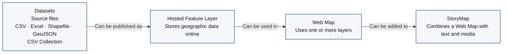
```mermaid
flowchart LR
    A["Datasets<br/>Source files<br/>CSV · Excel · Shapefile · GeoJSON<br/>CSV Collection"]
    B["Hosted Feature Layer<br/>Stores geographic data online"]
    C["Web Map<br/>Uses one or more layers"]
    D["StoryMap<br/>Combines a Web Map with text and media"]
    A -->|Can be published as| B
    B -->|Can be used in| C
    C -->|Can be added to| D
    classDef item fill:#f5f7fb,stroke:#2f6688,color:#111,stroke-width:1.5px;
    class A,B,C,D item;
```

A StoryMap can be copied directly, but its web maps and hosted layers are not automatically copied with it. If those connected items also need to move, handle them from top to bottom: source data and hosted layers first, then the web map, and finally the StoryMap.

#### **What Happens to Each Item Type During Transfer**

Use this table to see how common ArcGIS Online item types move and whether they still depend on the institutional account after migration.

| **Item type** | **How to transfer it** | **After the transfer** |
| --- | --- | --- |
| **CSV, Shapefile, and CSV Collection** | Use ArcGIS Assistant. | You own the copied file or collection. It no longer depends on the institutional account. |
| **Microsoft Excel** | Download the .xlsx file. | The file is saved on your computer. Upload a CSV copy if you want to use the table in your Public Account. |
| **Feature Service or Hosted Feature Layer** | Can not transfer entirely. Select Copy by reference. | Your account receives a link to the layer in the institutional account. The data stays in the institutional account. |
| **Feature Layer** | If exporting is available, export the layer as a GeoJSON file and upload it to the new account. Otherwise, select Copy by reference. | A GeoJSON upload creates an independent copy of the features and attributes. Copy by reference continues to use the original layer in the institutional account. |
| **Web Map** | Use ArcGIS Assistant. | You own the copied Web Map. Its layers still use their original item IDs or URLs until you move and reconnect them. |
| **StoryMap, Collection, or Theme** | Use ArcGIS Assistant. | You own the copied item. Text and uploaded media move with it, but embedded maps, layers, and web links stay connected to their original sources. |
| **Dashboard, Instant App, or Experience Builder app** | Use ArcGIS Assistant. | You own the copied app item. Its maps, layers, and services may still come from the institutional account. |
| **Survey123 or Field Maps content** | Move the form or app together with its maps and layers. | These items work as a set. Moving only the form or app leaves it connected to content in the institutional account. |
| **Map, image, vector tile, WMS, WFS, or other service layer** | Can not transfer entirely. Select Copy by reference. | Your account receives a link. The service stays at its original URL and does not move into your account. |
| **KML or KMZ, GeoPackage, file geodatabase, images, documents, or ArcGIS Pro packages** | Download the file. Upload it if your Public Account accepts the format. | The downloaded or uploaded file is yours and no longer depends on the institutional account. |

If you have questions about transferring other item types, contact the Data and Visualization Librarian ([siti.lei@dukekunshan.edu.cn](mailto:siti.lei@dukekunshan.edu.cn)) for help.

### **Create ArcGIS Public Account**

Before you begin, make sure you have access to two accounts: your **source account**, where your existing items are stored, and your **destination account**, where you want to transfer the items. If you need a destination account, follow the steps below to create a free ArcGIS public account.

1. Go to [ArcGIS Online](https://www.arcgis.com/) and click **Sign In**.

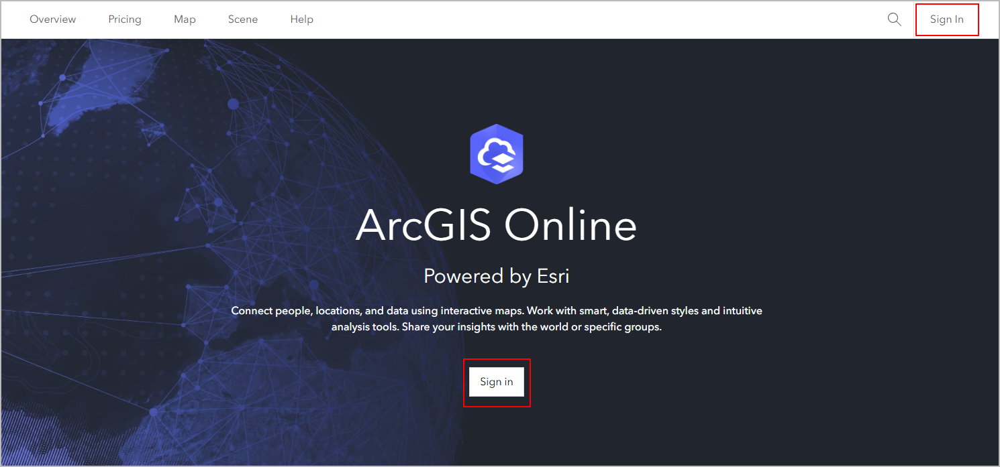

2. At the bottom of the sign-in window, click **Create an account**.

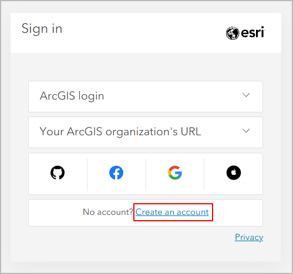

3. Under **Create a public account**, click **Create an account**.

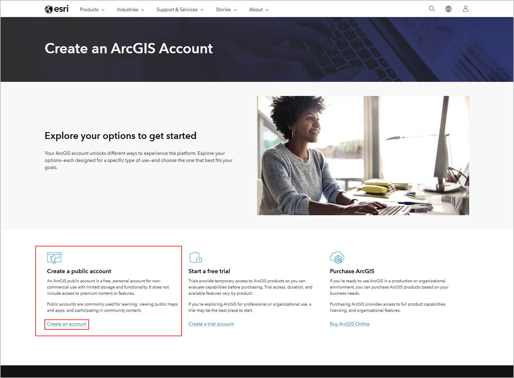

4. Enter your **first name**, **last name**, and **email address**. Accept the Esri Master License Agreement and Privacy Statement, then click **Next**.

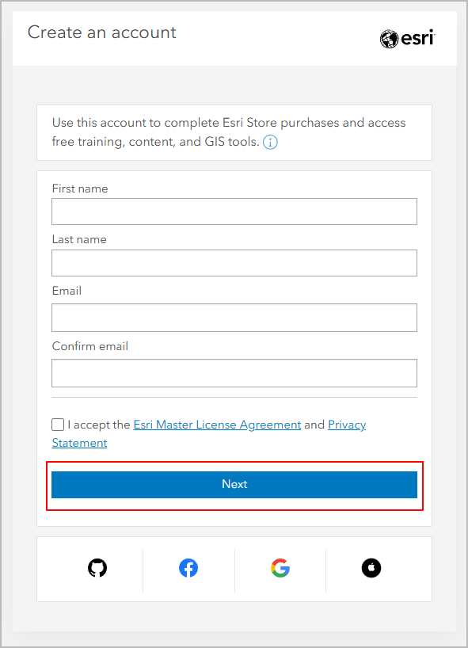

5. ArcGIS will send an activation email to the email address you entered. Open your **email inbox** to continue.

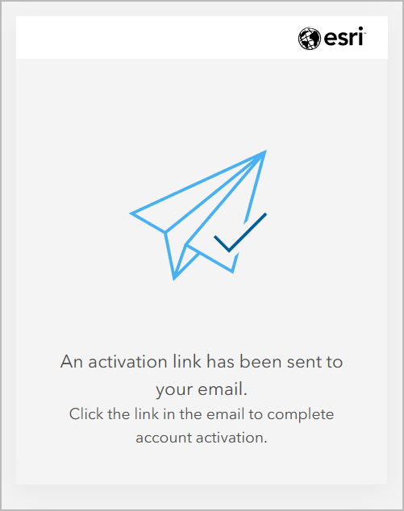

6. Open the email from the ArcGIS Accounts Team and click the **activation link**. The link expires after 24 hours.

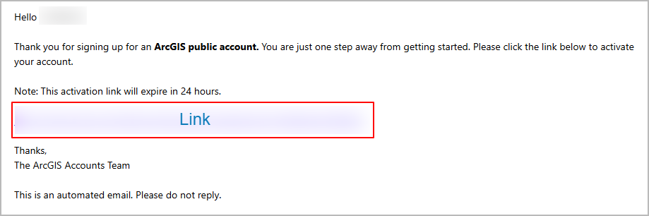

7. Create a **username** and **password**, select a **security question**, and enter your answer. Then click **Create account**.

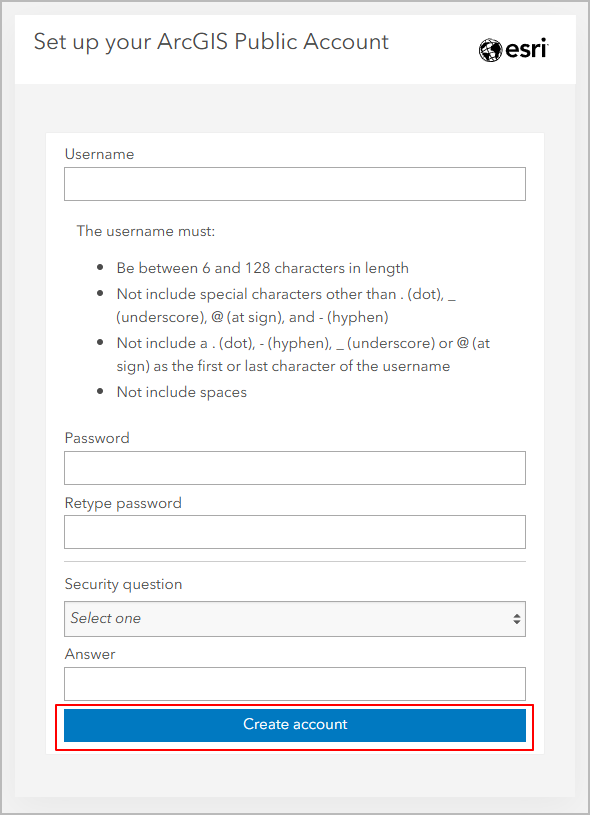

8. After the account is created, open the account menu in the upper-right corner and confirm that you are signed in to your new ArcGIS public account.

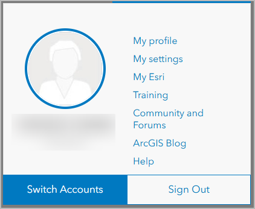

### **Download Items Directly from ArcGIS Online**

Use this method when you want to keep the data from a hosted feature layer. Export the layer as a GeoJSON file from your institutional account, then upload it to your public account. This method does not require ArcGIS Assistant. The features and attributes transfer with the file, but you may need to recreate symbols and other layer settings.

For this part, we use the Feature layer (hosted) and Microsoft Excel spreadsheet as our example.

#### **Map Layer**

For this section, we use a **Feature layer (hosted)** as an example.

1. Follow the [ArcGIS Online sign-in tutorial](https://github.com/itislei/DKU-Library-Data-Visualization-Tutorials/blob/main/ArcGIS/Signing%20In%20to%20ArcGIS.md) to sign in with your institutional account.

2. Open **Content**, then select a **Feature layer (hosted)** item that you own.

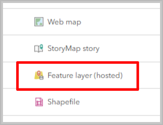

3. On the item page, open **Overview**, select **Export Data**, and choose **Export to GeoJSON**.

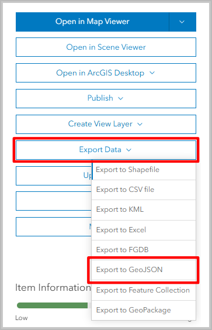

4. Enter a **Title**, choose a folder, and click **Export**.

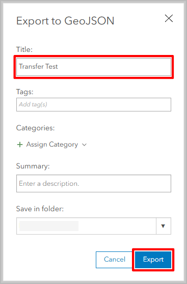

5. On the new item page, open **Overview** and click **Download**. Make sure the file is saved on your computer.

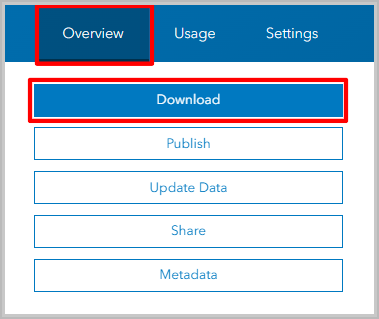

6. Next, sign in to your personal public account in ArcGIS Online.

7. Select **Map** tab to open Map Viewer.

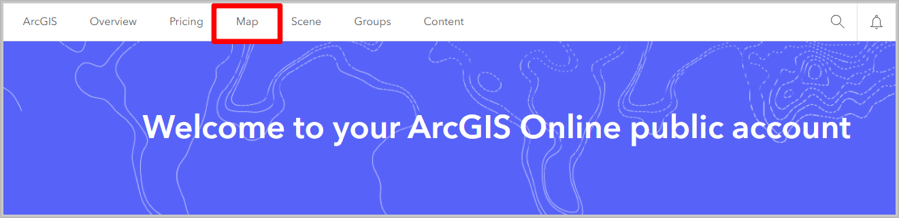

8. On the left toolbar, select **Add**, then choose **Add layer from file**.

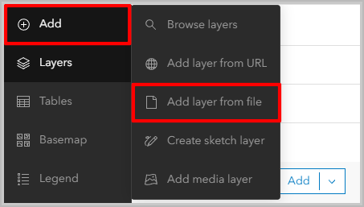

9. Find the location where GeoJSON file was saved, then select the downloaded **.geojson** file and click **Open**.

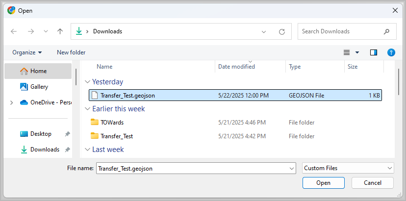

10. In the pop-up, click **Create and add to map**, and wait for the process to complete. Larger files may take longer to process.

11. On the left toolbar, select **Save and open**, then select **Save as**.

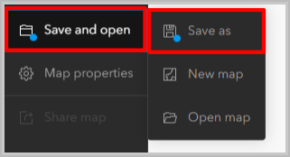

12. Enter a **Title** and click **Save**.

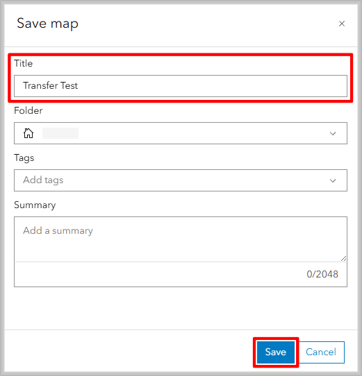

13. Go to **Content**. The file should be now saved in your public account.

#### **Dataset**

For this section, we use a **Microsoft Excel spreadsheet** as an example.

1. In ArcGIS Online, log in to your institutional account. Then, go to **Content**, locate an **Excel item**, and then click **Preview**.

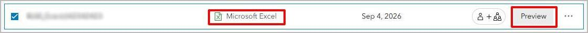

2. Go to the **details**, then click **Download**. The .xlsx file will be saved on your computer.

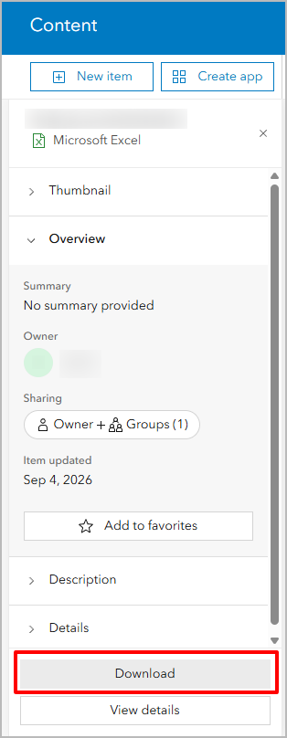

### **Convert and Upload a Dataset**

Use Microsoft Excel to convert the downloaded **.xlsx** workbook to a **CSV UTF-8** file. Then add the CSV to a map in your ArcGIS public account.

#### **Convert the XLSX File to CSV**

1. Open Microsoft Excel on your computer, and select the downloaded **.xlsx** workbook under Recent.

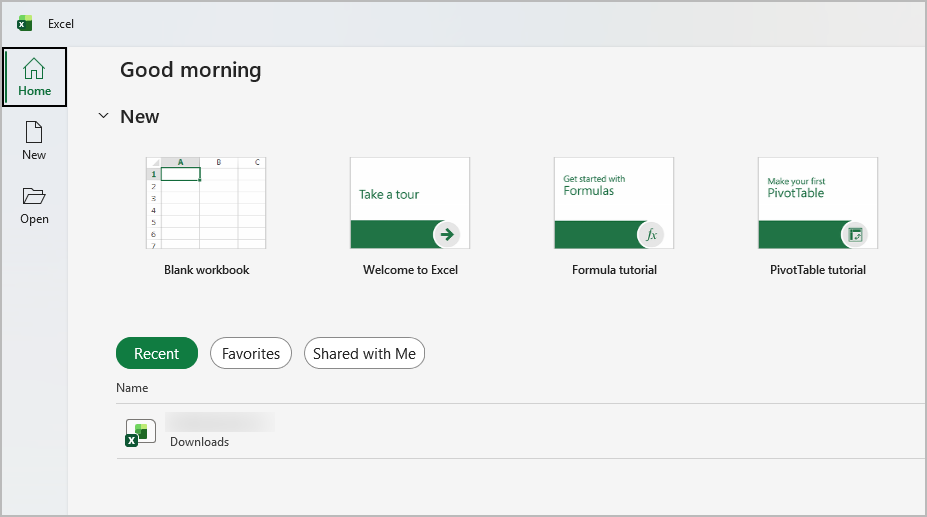

2. After the workbook opens, click **File**.

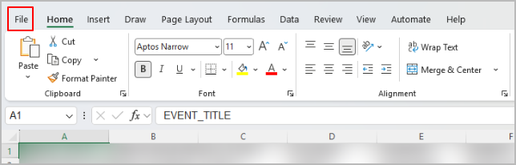

3. Select **Save As**.

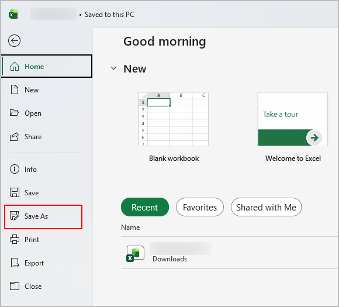

4. Choose a save location, enter a clear file name, and open the file-format menu.

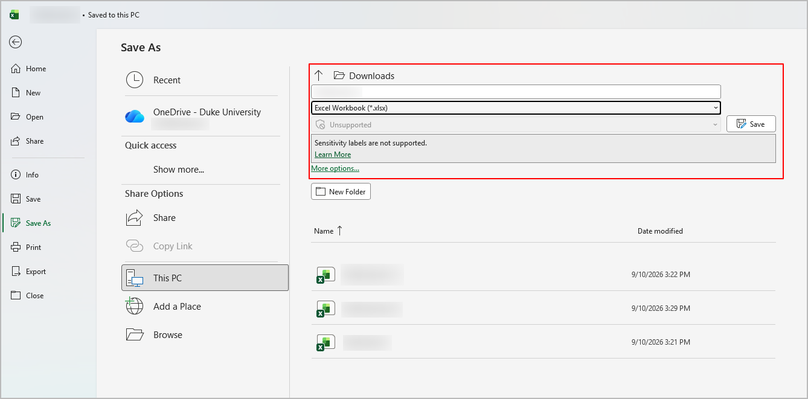

5. Select **CSV UTF-8 (Comma delimited) (.csv)**. UTF-8 helps preserve Chinese and other non-English characters.

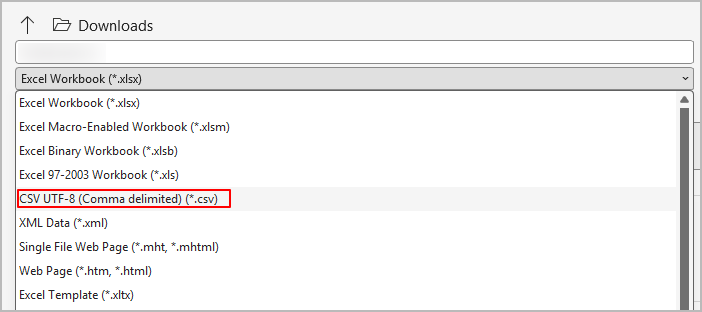

6. Click **Save**.

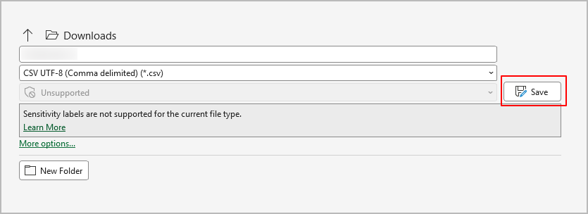

7. If Excel explains that CSV does not support multiple sheets, click **OK** to save the active sheet.

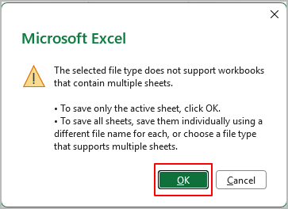

CSV files save only the active worksheet and the values shown in its cells. If the workbook contains **multiple worksheets**, save each worksheet as **a separate CSV file**. Formatting, charts, and other Excel features are not included. Keep the original **.xlsx** file as a backup.

#### **Add the CSV as a Map Layer**

Use this method when the CSV contains location information and you want to display the data on a map.

1. Sign in to ArcGIS Online with your public account and open **Map** to start Map Viewer.

2. Open **Layers**, click the arrow next to **Add**, and select **Add layer from file**.

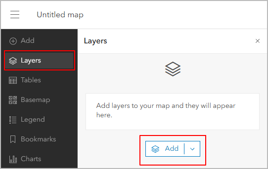

3. Select the CSV file saved from Excel. If ArcGIS asks how to locate the data, check that the correct latitude and longitude or address fields are selected.

4. Enter a **Title**, choose a folder, and click **Create and add to map**.

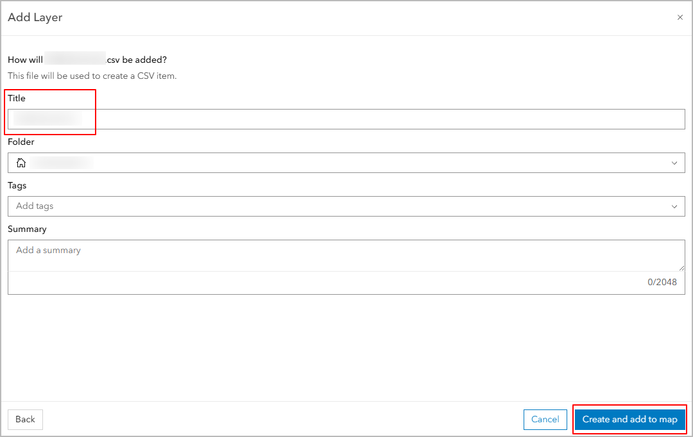

5. Confirm that the new CSV layer appears in the **Layers** panel and displays correctly on the map.

#### **Upload the CSV as a File Item**

This optional method is useful if you only want to store the CSV in your account so it can be downloaded later. It does not add the data to a map.

1. In your public account, open **Content**, select **My content**, and click **New item**.

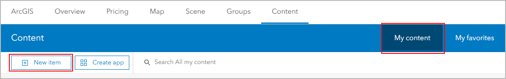

2. Select **Your device** and choose the CSV file.

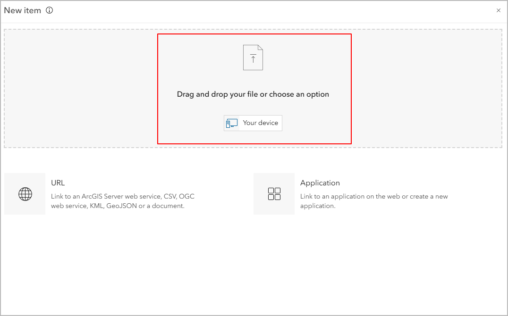

3. Enter a **Title**, choose a folder, add tags or a summary if needed, and click **Save**.

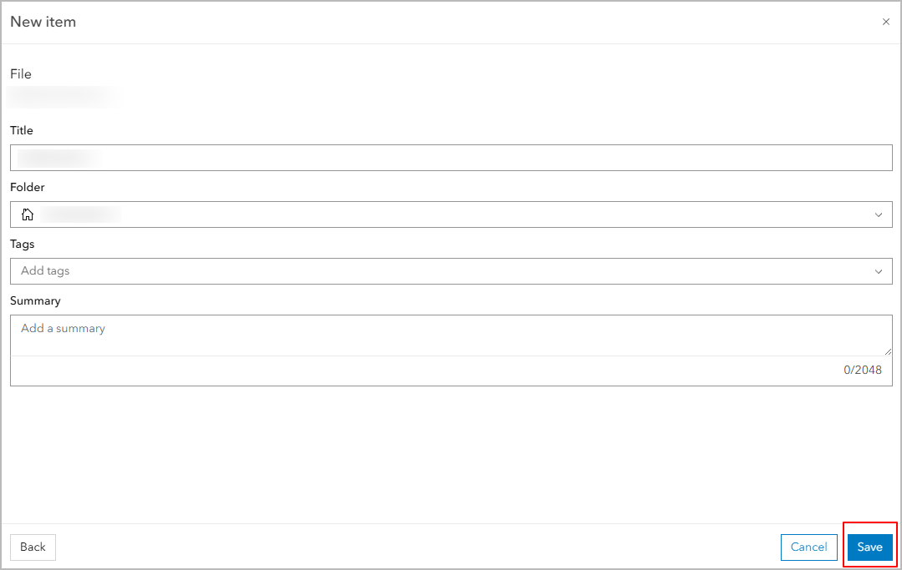

Other spreadsheet applications and file-conversion tools can also create CSV files. Before using an online converter, consider whether the data contains **private, sensitive, or restricted information** and review the tool's **privacy and security practices**.

For more information, see Esri's [Add layers from files](https://doc.arcgis.com/en/arcgis-online/create-maps/add-layers-from-file.htm) documentation.

### **Transfer Items Using ArcGIS Assistant**

In this section, we will use **ArcGIS Assistant** to transfer items between ArcGIS Online accounts. ArcGIS Assistant is a tool designed to help migrate content between accounts.

#### **Sign In to ArcGIS Assistant**

1. Open **ArcGIS Assistant** at [https://assistant.esri-ps.com/](https://assistant.esri-ps.com/) and click **Sign in** at the top right corner.

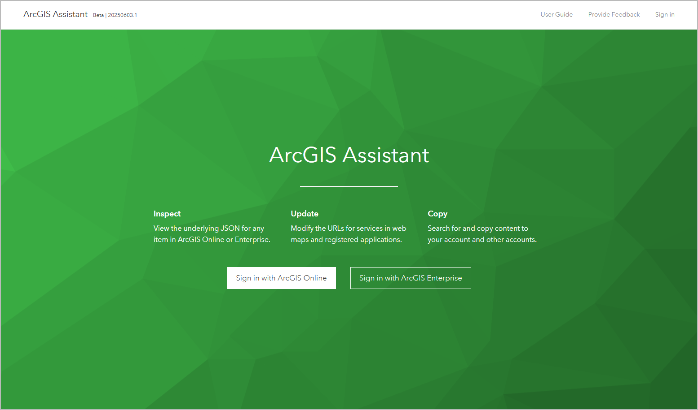

2. Type **“Dukeuniv”** to sign in to your institutional ArcGIS Online account.

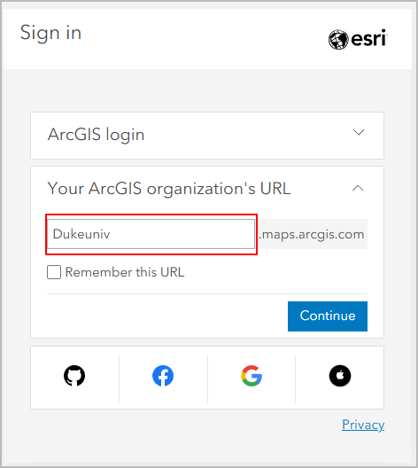

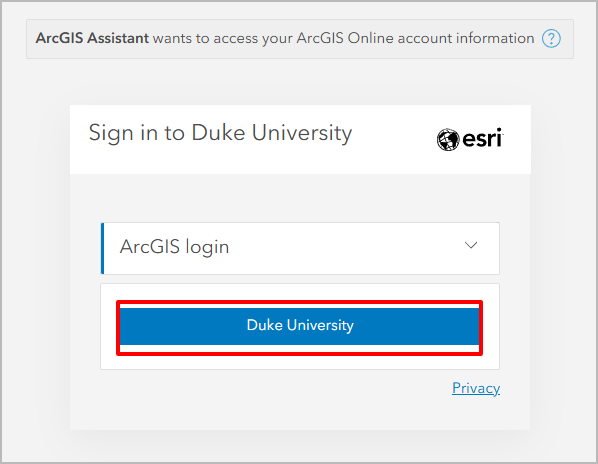

3. Select **My Content**.

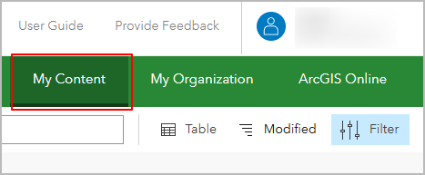

4. Click the **account icon** in the upper-right corner.

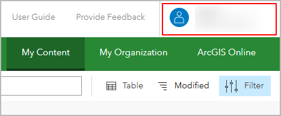

5. If your personal account is not listed under **Recent accounts**, select **Add ArcGIS Online Account**.

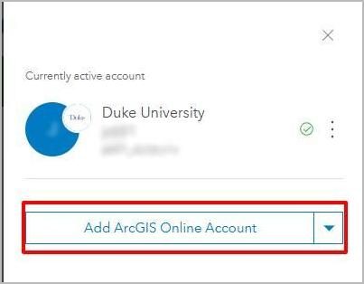

6. Sign in with your personal account. If you have a public account, use **ArcGIS login**.

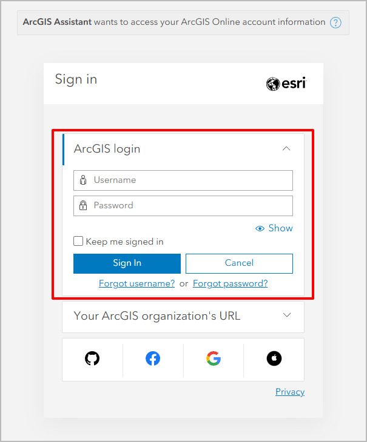

#### **Copy Items to Your Personal Account**

This approach applies to CSV, Shapefile, GeoJSON, CSV Collection, web map, and StoryMap items. If the items are connected and used within one project, migrate them in dependency order. In the case of a StoryMap, copy the source data first, then the web map, and finally the StoryMap.

1. Make sure your institutional account is **active** and that you are logged in to ArcGIS Assistant.

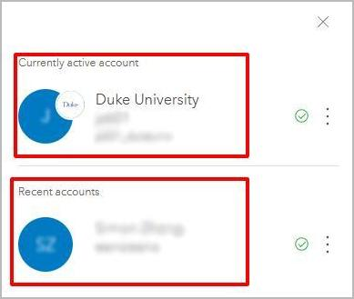

2. If another account is active, click the three dots next to your institutional account and select **Switch active account**.

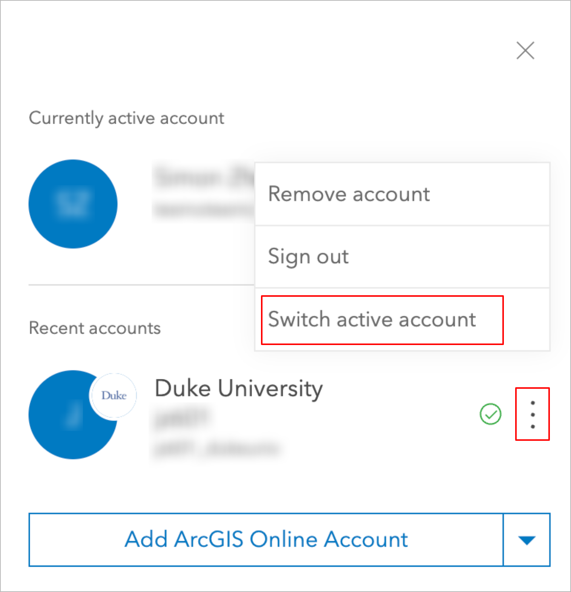

3. Under **My Content**, locate the item you want to migrate.

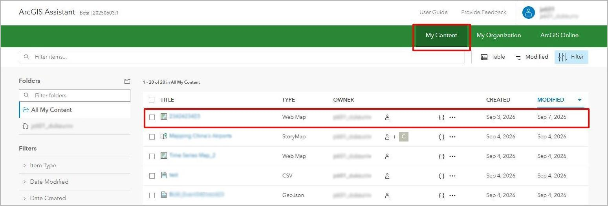

4. Check the **Title** and **Type**.

5. Select the **checkbox** beside the item.

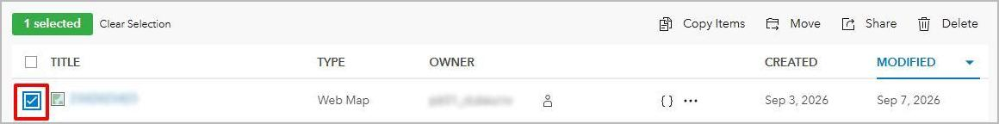

6. Click **Copy Items**.

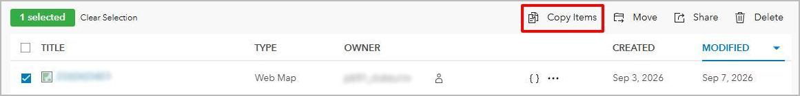

7. Under **Copy Destination**, select your personal account.

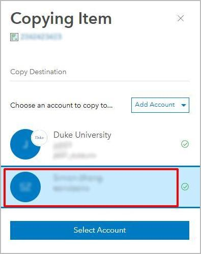

8. Click **Select Account**.

9. Select a folder and click **Select Folder**.

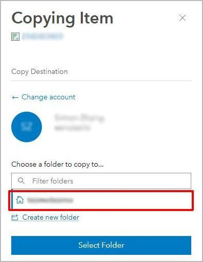

10. Check that the **Item Title** is correct.

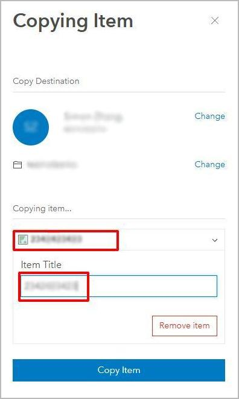

11. Click **Copy Item**.

12. When the copy is complete, click **Open in ArcGIS Online**.

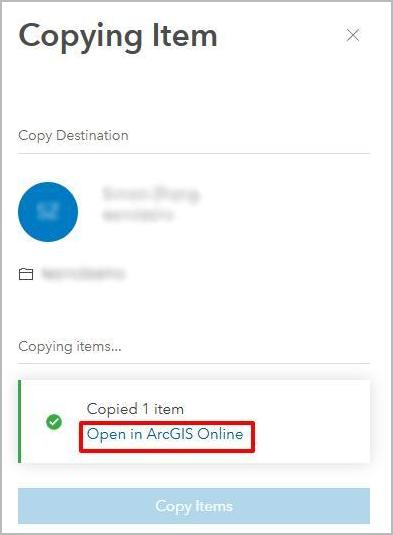

#### **Transfer Items That Cannot Be Copied Directly**

Some item types, such as feature services, hosted feature layers, feature layers, and media layers, **cannot** be copied as a complete item using ArcGIS Assistant. Instead, they can be copied as **a reference**, which means the copied item continues to use the original service in the institutional account. If the original service is deleted or access is removed, the copied item will **no longer work**. In this tutorial, we use a hosted feature layer as an example.

1. In ArcGIS Assistant under **My Content**, find the hosted layer. ArcGIS Assistant may show its **Type** as **Feature Service**.

2. Select the checkbox beside the item and click **Copy Items**.

3. Under **Copy Destination**, select **your personal account**.

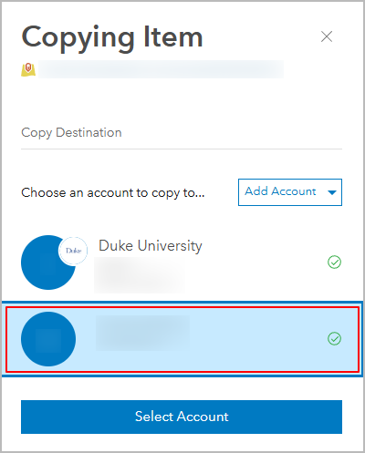

4. Click **Select Account**.

5. Select a folder and click **Select Folder**.

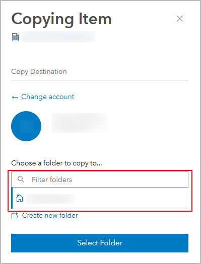

6. Check that the **Item Title** is correct.

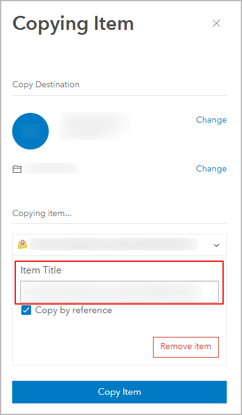

7. Select **Copy by reference**.

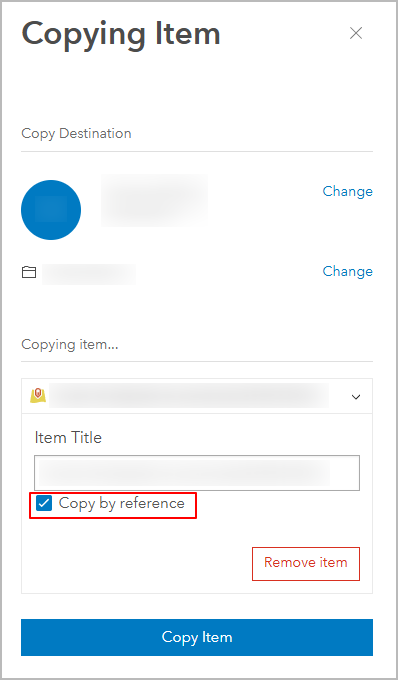

8. Once everything is ready, click **Copy Item**.

9. When the copy is complete, click **Open in ArcGIS Online**.

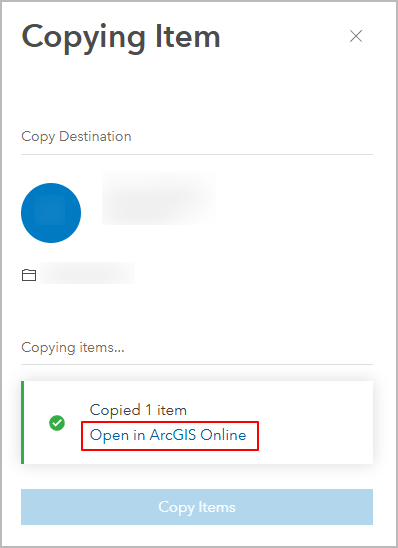

*Note:* **Copy by reference** creates an item in the personal account, but the data and service remain in the institutional account. **Leave the URL unchanged** unless the same layer has been published at a new service URL.

### **After Transfer**

After the transfer, sign in to your personal account in [ArcGIS Online](https://www.arcgis.com/) and make sure the items were transferred correctly. After logging in, go to the **Content** tab and check that the transferred items and item types are correct.

#### **CSV Shapefile GeoJSON and CSV Collection**

1. **Open** each copied item.

2. For **CSV, Shapefile, and GeoJSON**, **confirm** that the file can be **downloaded**.

3. For a **CSV Collection**, **confirm** that its **tables and files** are available.

#### **Web Map**

1. **Open** the copied **Web Map**.

2. **Open** the map in **Map Viewer**.

3. **Open** the **Layers** panel.

4. **Confirm** that every layer displays correctly.

A Web Map stores map settings and links to its layers. A copied map may still use layers from the institutional account.

#### **StoryMap**

1. **Open** the copied **StoryMap**.

2. **Select View Story.**

3. **Check** the **text, images, maps, and other media**.

Web Maps, Web Scenes, hosted layers, embeds, and linked media are separate connected items. Confirm that each one opens correctly.

#### **Hosted Feature Layer**

1. **Open** the copied item.

2. **Confirm** that the **service URL** opens.

3. **Confirm** that the layer displays correctly.

#### **Final Check**

- **Each copied item** appears in the **correct folder**;

- **Item titles** are **clear**;

- **Files, maps, layers, and stories** open as expected.

### **Resources**

This tutorial focuses on transferring some common items in ArcGIS Online from an institutional account to a personal public account or other institution’s account. For help with other item types or more complex projects, use the following resources:

- [ArcGIS Assistant User Guide](https://guide.assistant.esri-ps.com/) for inspecting, copying, and modifying ArcGIS items;

- [ArcGIS Assistant Common Workflows](https://guide.assistant.esri-ps.com/docs/common-workflows) for copying StoryMaps and understanding referenced content;

- [Migrating Content Between ArcGIS Online Organizational Accounts](https://sites.psu.edu/psugis/software/migrating-agol-content/) by Penn State for an older ArcGIS Online Assistant workflow;

- [ArcGIS Online Account and Public Account FAQ](https://doc.arcgis.com/en/arcgis-online/reference/faq.htm) by Esri;

- [ArcGIS Online Resources](https://www.esri.com/en-us/arcgis/products/arcgis-online/resources) by Esri;

- [ArcGIS Online Community](https://community.esri.com/t5/arcgis-online/ct-p/arcgis-online) for questions and shared solutions;

- [ArcGIS Assistant Feedback](https://github.com/EsriPS/arcgis-assistant-feedback) for reporting problems with the beta application.

If you have any questions about the tool or this tutorial, do not hesitate to contact the Data and Visualization Librarian, Siti Lei ([siti.lei@dukekunshan.edu.cn](mailto:siti.lei@dukekunshan.edu.cn)), for further support.
